# LEMP

Step 1 - Installing Nginx web server

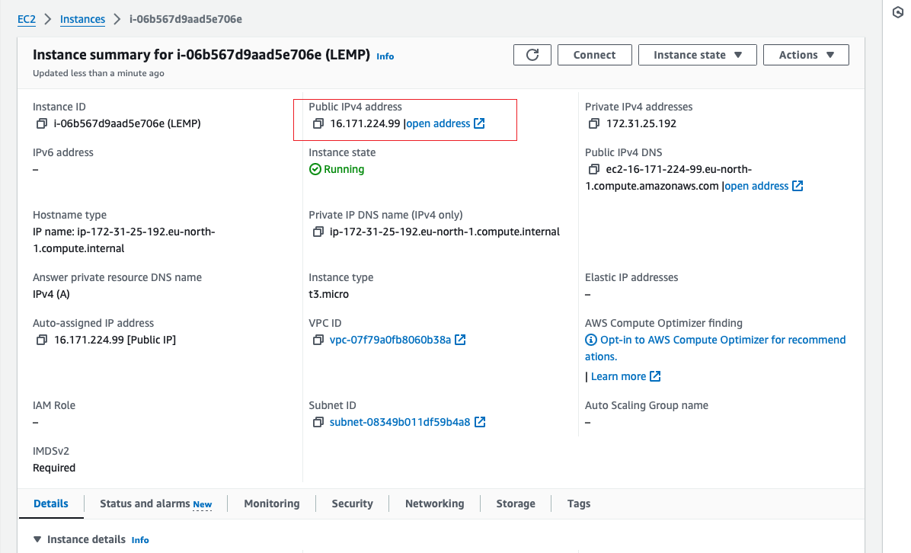

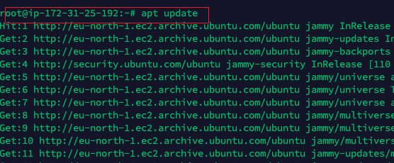

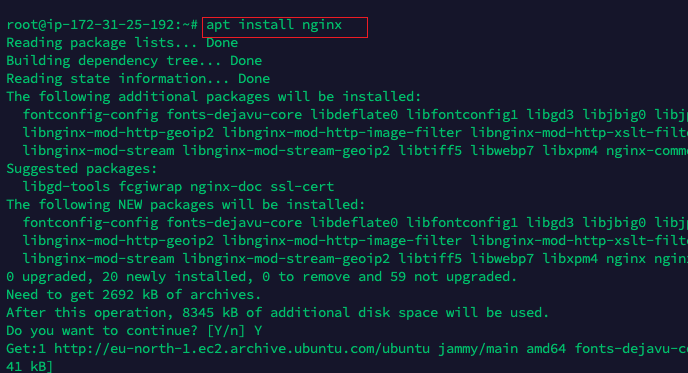

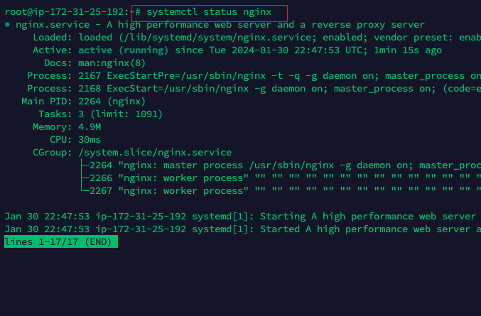

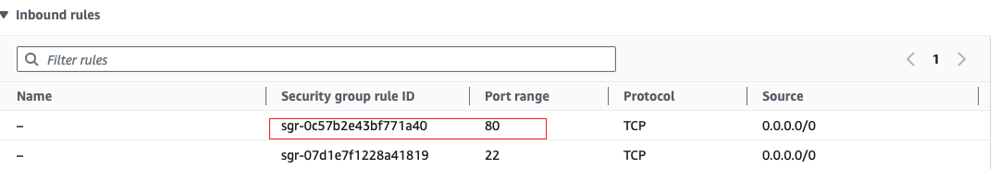

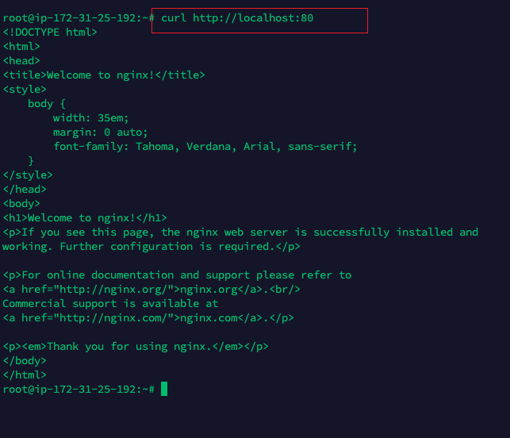

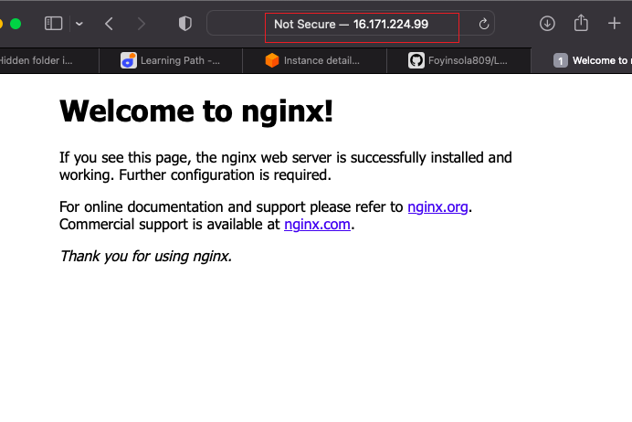

Step 2 - Installing Mysql

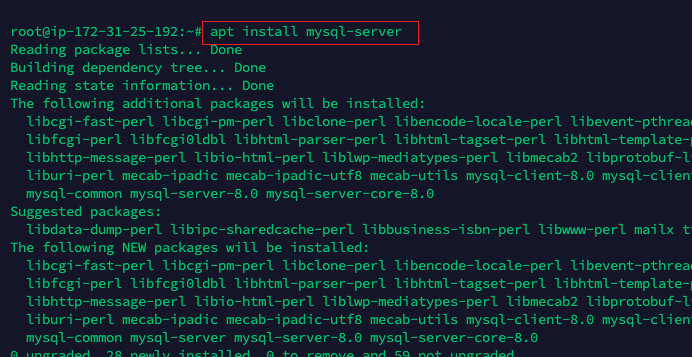

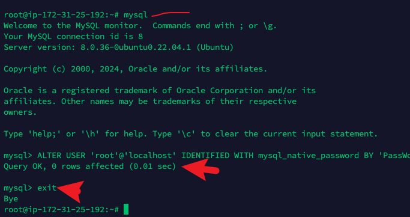

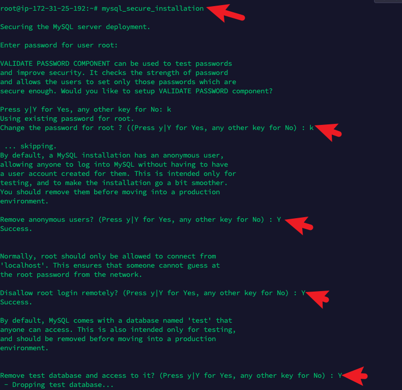

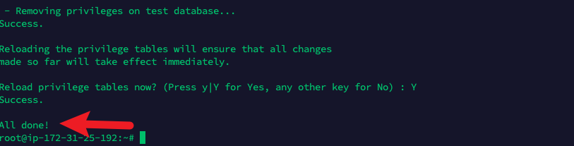

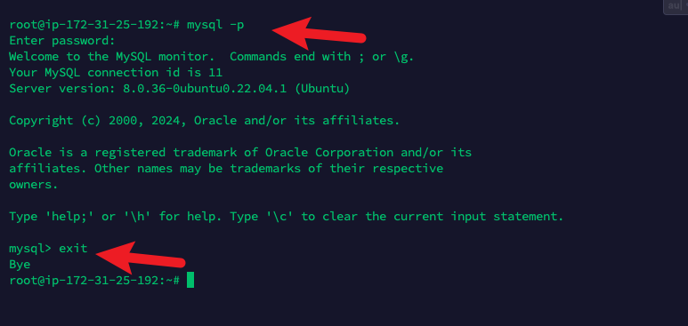

Step 3 - Installing PHP

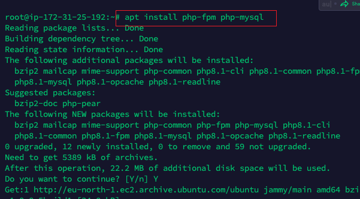

Step 4 - Configuring Nginx to use PHP Processor

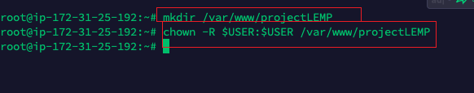

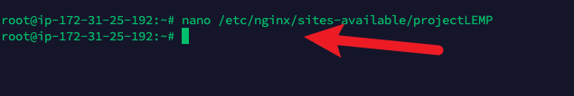

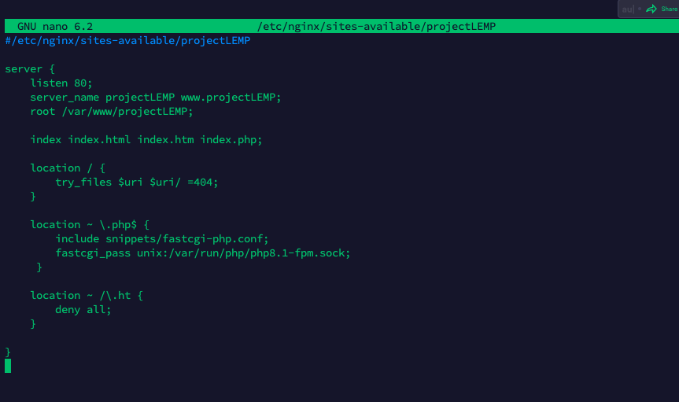

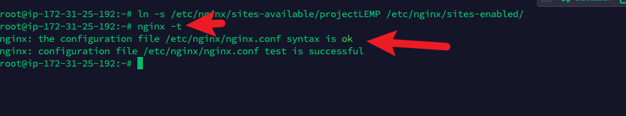

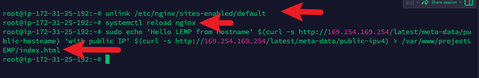

Step 5 - Testing PHP with Nginx

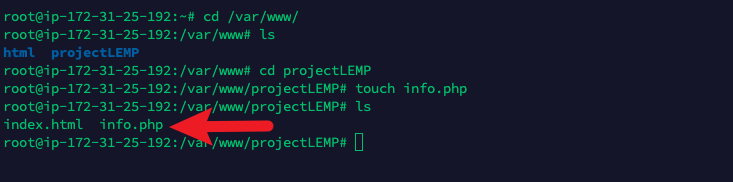

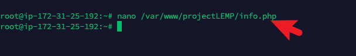

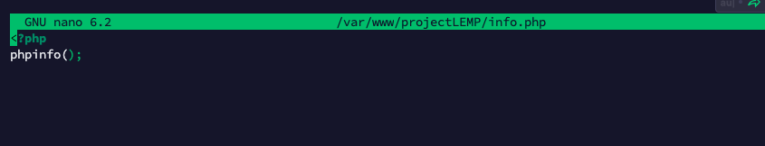

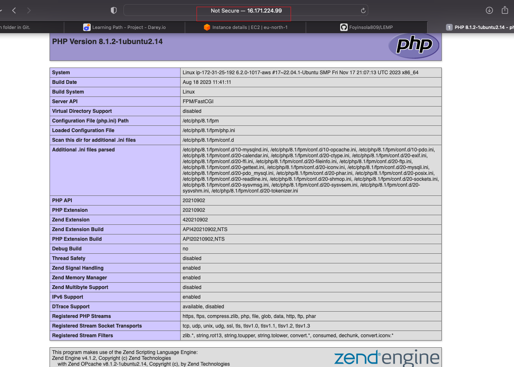

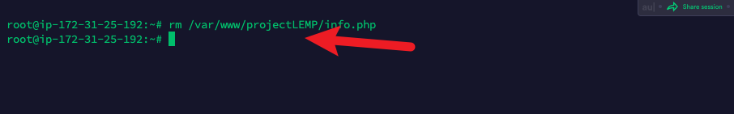

Step 6 - Retrieving data from Mysql database with PHP

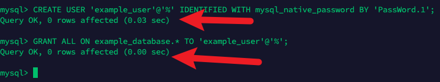

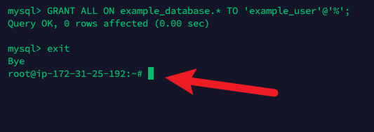

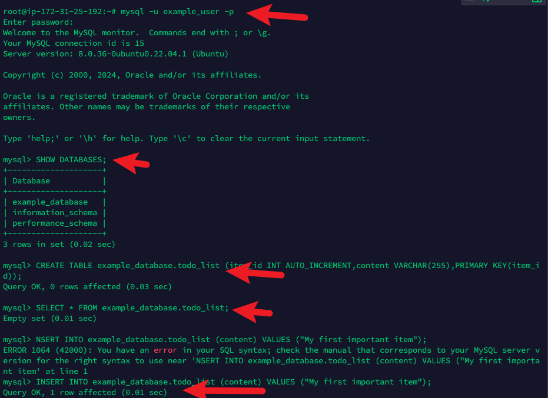

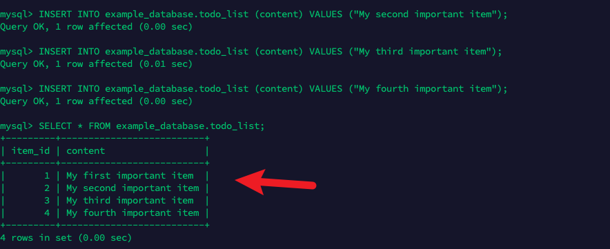

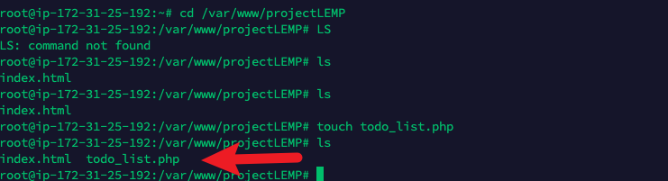

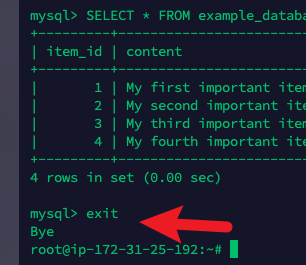

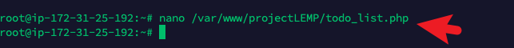

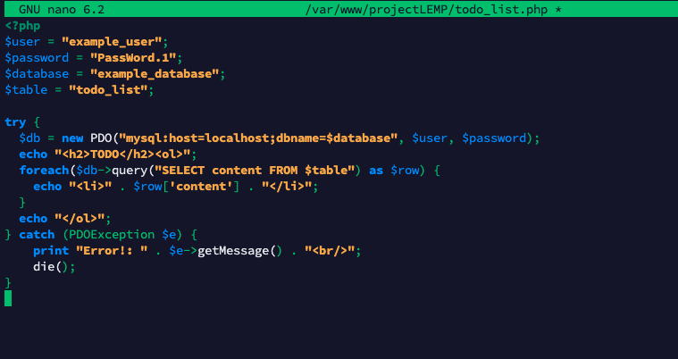

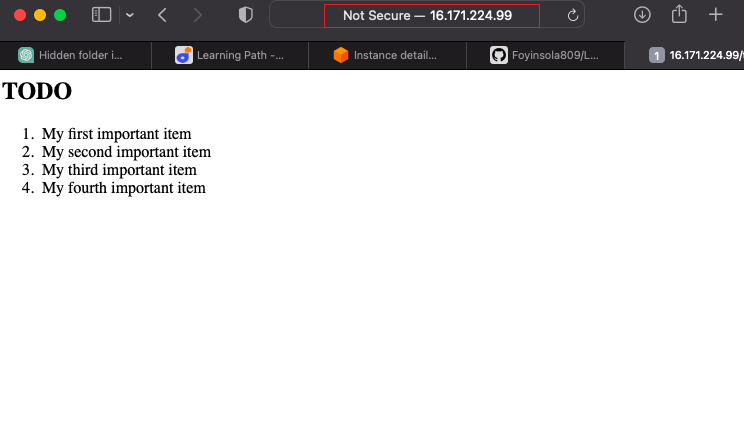

