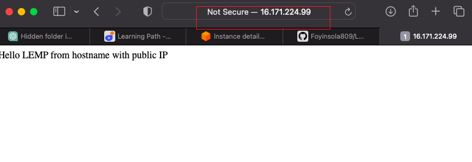
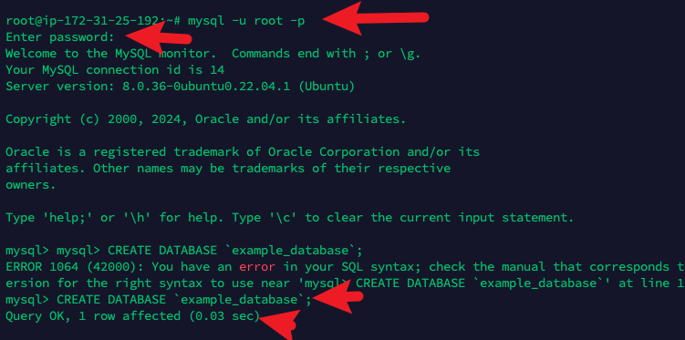

# LEMP

Step 1 - Installing Nginx web server

Step 2 - Installing Mysql

Step 3 - Installing PHP

Step 4 - Configuring Nginx to use PHP Processor

Step 5 - Testing PHP with Nginx

Step 6 - Retrieving data from Mysql database with PHP

